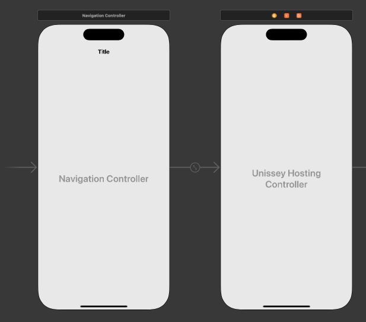
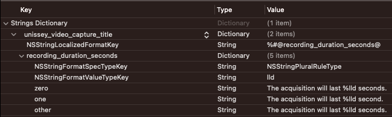
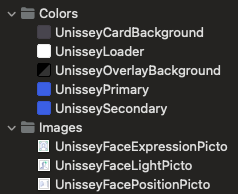

<!-- Using HTML notation instead of MD to prevent the TOC generation from picking up this header --> 
<h1>Unissey iOS/macOS SDK</h1>

[
](#12-installation)
&nbsp;


This iOS/macOS Framework provides an easy way to obtain a video selfie to be used with Unissey's
SaaS
solution on an iOS or macOS application. This SDK has been developed with SwiftUI, allowing for
an easy integration on both SwiftUI apps and traditional UIKit apps.

<!-- @formatter:off -->
<!-- TOC -->
  * [1. Installation & requirements](#1-installation--requirements)
    * [1.1 Requirements](#11-requirements)
    * [1.2 Installation](#12-installation)
      * [1.2.1 Swift Package Manager](#121-swift-package-manager)
      * [1.2.2 CocoaPods](#122-cocoapods)
  * [2. Getting started](#2-getting-started)
    * [2.1 Overview](#21-overview)
    * [2.2 UnisseyViewModel](#22-unisseyviewmodel)
    * [2.3 UnisseyScreen](#23-unisseyscreen)
      * [2.3.1 SwiftUI](#231-swiftui)
      * [2.3.2 Traditional UIKit app](#232-traditional-uikit-app)
  * [3. Reference](#3-reference)
    * [3.1 AcquisitionPreset](#31-acquisitionpreset)
    * [3.2 OnRecordEndedListener](#32-onrecordendedlistener)
    * [3.3 OnStateChangedListener](#33-onstatechangedlistener)
    * [3.4 SessionConfig](#34-sessionconfig)
    * [3.5 UnisseyViewModel's public variables and functions](#35-unisseyviewmodels-public-variables-and-functions)
    * [3.6 String resources](#36-string-resources)
    * [3.7 Colors](#37-colors)
    * [3.8 Images](#38-images)
    * [3.9 Typography](#39-typography)
  * [4. Advanced usage](#4-advanced-usage)
    * [4.1 Specifying a SessionConfig](#41-specifying-a-sessionconfig)
    * [4.2 Customizing the texts and translations](#42-customizing-the-texts-and-translations)
    * [4.3 Customizing the assets (colors and images)](#43-customizing-the-assets-colors-and-images)
    * [4.4 Customizing the types](#44-customizing-the-types)
    * [4.5 Auto-starting the video capture when the camera's ready](#45-auto-starting-the-video-capture-when-the-cameras-ready)
    * [4.6 Enabling Injection Attack Detection (IAD)](#46-enabling-injection-attack-detection-iad)
      * [4.6.1 Obtain the IAD data from your Back-End](#461-obtain-the-iad-data-from-your-back-end)
      * [4.6.2 Create an IadConfig to add to the SessionConfig](#462-create-an-iadconfig-to-add-to-the-sessionconfig)
      * [4.6.3 Send the metadata along with the video to the /analyze endpoint](#463-send-the-metadata-along-with-the-video-to-the-analyze-endpoint)
  * [5. Common issues](#5-common-issues)
    * [5.1 Add camera requirement to your application](#51-add-camera-requirement-to-your-application)
<!-- TOC -->
<!-- @formatter:on -->

## 1. Installation & requirements

### 1.1 Requirements

The version of your app must be at least iOS 14.0 and macOS 11.0 in order to use this SDK.

### 1.2 Installation

#### 1.2.1 Swift Package Manager

The [Swift Package Manager](https://swift.org/package-manager/) is a tool for automating the
distribution of Swift code and is integrated into the `swift` compiler.

Once you have your Swift package set up, adding Alamofire as a dependency is as easy as adding it to
the `dependencies` value of your `Package.swift` or the Package list in Xcode.

```swift
dependencies: [
    .package(url: "https://github.com/unissey/sdk-ios.git", .upToNextMajor(from: "3.4.0"))
]
```

After that, you can depend on the `UnisseySdk` target:

```swift
.product(name: "UnisseySdk", package: "UnisseySdk")
```

#### 1.2.2 CocoaPods

[CocoaPods](https://cocoapods.org) is a dependency manager for Cocoa projects. For usage and
installation instructions, visit their website. To integrate UnisseySdk into your Xcode project
using CocoaPods, specify it in your `Podfile`:

```ruby
pod 'UnisseySdk'
```

## 2. Getting started

### 2.1 Overview

Unissey's SDK offers three screens, one of which is optional:

1. If you choose to, the user is greeted with a screen displaying instructions on what to do to
   ensure our algorithms are delivering the best results possible.
2. Then, if your application hasn't already asked for the user's permission to use the camera, a
   screen presenting a brief explanation on why the app requires the use of the camera is displayed.
   A button on this page will make the system dialog appear to request the user's consent to let the
   app use the camera. If the user happens to decline, subsequent clicks on this button will
   redirect to the settings page where the user will have to manually grant permission to the
   camera.
3. Finally, if the permission has been granted, the main screen is displayed featuring a live
   preview of the camera. This screen provides a button (or none if you choose to hide it) that
   starts the video capture process. This process is divided in two steps. The SDK will start by
   detecting the user's face and providing indications, based on the face's location, to help the
   user position their face in the center of the frame. Once it's done and the user stayed still for
   at least one second, the actual video recording will start for the duration you specified with
   the
   Acquisition Preset.

The sample apps are here to provide a basic implementation of this library that you can use as a
base for your integration inside your own application. Whether you're using SwiftUI
or a traditional approach with UIKit, you will have to create a `UnisseyViewModel` and
a `UnisseyScreen` to interact with this SDK. The `UnisseyViewModel` is the developer interface with
which you can interact in your application's code, it's also the class that you can configure to
suit your needs. The `UnisseyScreen` on the other hand holds the user interface and it's what your
user will see and interact with.

### 2.2 UnisseyViewModel

The `UnisseyViewModel` class offers a constructor that should be used to create an instance of it.
Only an `AcquisitionPreset` object and an `OnRecordEndedListener` are necessary to use the SDK. Note
that the `OnRecordEndedListener` is optional during the initialization of the `UnisseyViewModel`
since, most of the time, you're going to want to reference `self` inside your callback to handle the
result, and there are situations where you will not be able to reference `self` when initializing
the object. This field is still mandatory for the SDK to hand back a response, if you fail to
provide an `OnRecordEndedListener`, the user will get stuck at the end of the video acquisition.

In addition to those parameters, the SDK can be further customized with an `OnStateChangedListener`
and a `SessionConfig`. All of these parameters are detailed in the [Reference](#3-reference)
section.

See the following code for simple usages where the default values are suitable for your use case:

```swift
let unisseyViewModel = UnisseyViewModel(acquisitionPreset: .selfieFast, onRecordEndedListener: { result in
    do {
        // `result` is a Result<Success, Failure> containing the response or an error
        let response = try result.get()
        print("Video record ended with file path: '\(response.videoFilePath)'")
    } catch {
        print("An error occurred while recording the video: \(error)")
    }
})
```

### 2.3 UnisseyScreen

Once you have an instance of `UnisseyViewModel`, you can create the `UnisseyScreen` with the
ViewModel as a parameter.

#### 2.3.1 SwiftUI

In SwiftUI, you can use the `UnisseyScreen` as you would use any other View in your application:

```swift
struct ContentView: View {
    var body: some View {
        let unisseyViewModel = ...
     
        UnisseyView(unisseyViewModel: unisseyViewModel)
    }
}
```

#### 2.3.2 Traditional UIKit app

If your application is built with the older Storyboard and UIKit system, you can rely on
a [UIHostingController](https://developer.apple.com/documentation/swiftui/uihostingcontroller) to
host the SwiftUI `UnisseyView`. If you're not familiar with this class, it's a view controller that
encapsulates and manages a SwiftUI hierarchy. You just need to provide a SwiftUI view as
the `rootView` parameter when initializing your hosting controller:

```swift
import Foundation
import SwiftUI
import UnisseySdk

class UnisseyHostingController: UIHostingController<UnisseyView> {
    
    var videoUri: URL?
    let unisseyViewModel: UnisseyViewModel
    
    required init?(coder: NSCoder) {
        // Set up the UnisseyViewModel and UnisseyView
        unisseyViewModel = UnisseyViewModel(acquisitionPreset: .selfieFast)
        let unisseyView = UnisseyView(unisseyViewModel: unisseyViewModel)
        super.init(coder: coder, rootView: unisseyView)
    }
    
    override func viewDidLoad() {
        // Register the callback
        unisseyViewModel.onRecordEndedListener = { result in
            do {
                // `result` is a Result<SessionResponse, Error> containing the response or an error
                let response = try result.get()
                print("Video record ended with file path: '\(response.videoFilePath)'")
                self.videoUri = response.videoFilePath
                
                DispatchQueue.main.async {
                    // Navigate to the next screen
                }
            } catch {
                print("An error occurred while recording the video: \(error)")
            }
        }
    }
}
```

You can use this `UIHostingController` as you would use any standard `UIViewController` in your
storyboard:



## 3. Reference

### 3.1 AcquisitionPreset

The present SDK provides presets defining how the video is recorded. Even if you decide to override
its values, you must select a preset when creating an instance of `UnisseyViewModel`.
Here are the 2 current possible values of `AcquisitionPreset`:

| Preset name       | Recording duration | Video quality                          | Description                                                                                                                        |
|-------------------|--------------------|----------------------------------------|------------------------------------------------------------------------------------------------------------------------------------|
| selfieFast        | 1 second           | 720p resolution if possible, or 1080p  | The preset that most use cases rely on. It provides the minimal configuration needed for Unissey's AI models to work at their best |
| selfieSubstantial | 3 seconds          | 720p resolution if possible, or 1080p  | The preset fit for use cases aiming for a PVID substantial compliance                                                              |

### 3.2 OnRecordEndedListener

This is the callback that triggers when the user is done recording a video.

This is a type alias for `(Result<SessionResponse, Error>) -> Void`.

The `SessionResponse`:

| Parameter name | Type   | Description                                                                                          |
|----------------|--------|------------------------------------------------------------------------------------------------------|
| videoFilePath  | URL    | The path to the video file saved in the cache directory of your app                                  |
| metadata       | String | A String containing technical metadata useful to Unissey to be added to the request to Unissey's API |

### 3.3 OnStateChangedListener

This is a callback that triggers everytime there's a significant change of state while the user is
interacting with the SDK. This callback offers a possibility for your application to react to SDK
and user events while the SDK is being used. This allows for more advanced usages that you could
have, some of which are described in the [Advanced usages](#4-advanced-usage) section.

This is a type alias for `(UnisseyEvent) -> Void`.

A `UnisseyEvent` represents an event happening inside the SDK, often initiated by the user. Here's
an exhaustive list of possible events:

| Event                     | Description                                                                                                                                                                                                                                                                              |
|---------------------------|------------------------------------------------------------------------------------------------------------------------------------------------------------------------------------------------------------------------------------------------------------------------------------------|
| instructionsShown         | When the Instructions screen is displayed to the user                                                                                                                                                                                                                                    |
| cameraPermissionShown     | When the Camera Permission screen is displayed to the user. This screen provides a simple explanation as to why this permission is necessary                                                                                                                                             |
| cameraPermissionRequested | When the camera permission has been requested, meaning when the system alert is being displayed to the user                                                                                                                                                                              |
| cameraPermissionAccepted  | When the user has accepted the permission                                                                                                                                                                                                                                                |
| cameraPermissionDenied    | When the user has declined the permission                                                                                                                                                                                                                                                |
| cameraPreviewShown        | When the Video Capture screen is displayed, showing a live preview of the camera                                                                                                                                                                                                         |
| cameraReady               | There is an initialization delay before the camera is fully set up and available. This event fires when the camera is actually ready to record a video.                                                                                                                                  |
| videoCaptureStarted       | When the video capture has started. The term "video capture" refers to the process that begins when the user hits the "Start" button. The recording doesn't start right away, there's a first stage where a face detection is happening to help the user position their face in the oval |
| videoRecordStarted        | When the recording has started                                                                                                                                                                                                                                                           |
| videoRecordProgress       | This event is the only one to feature a parameter. It fires multiple times during the recording and provides a `progress` parameter indicating the recording progress with a value contained between 0 and 1 (1 being 100%)                                                              |
| videoRecordEnded          | When the recording is over. This event triggers along with the `OnRecordEndedListener` callback                                                                                                                                                                                          |

### 3.4 SessionConfig

If the default state of the SDK doesn't suit your needs, the `UnisseyViewModel` can take
a `SessionConfig` parameter with ways to customize the behavior of the library.

Here's what a `SessionConfig` is composed of:

| Parameter name  | Type            | Description                                                     |
|-----------------|-----------------|-----------------------------------------------------------------|
| recordingConfig | RecordingConfig | Responsible for additional video settings                       |
| uiConfig        | UiConfig        | Responsible for graphic configuration                           |
| iadConfig       | IadConfig       | Responsible for activating the IAD (Injection Attack Detection) |

The `RecordingConfig`:

| Parameter name      | Type            | Default value | Description                                                                                                                             |
|---------------------|-----------------|---------------|-----------------------------------------------------------------------------------------------------------------------------------------|
| recordingDurationMs | Float?          | nil           | The duration of the recording, overrides the value from the `AcquisitionPreset`                                                         |
| qualities           | [VideoQuality]  | nil           | An array of `VideoQuality` to override the qualities set in the `AcquisitionPreset`. The qualities are to be set in order of preference |

The `VideoQuality` is an enum representing available qualities that the video can be recorded in:

| Quality | Resolution                                         |
|---------|----------------------------------------------------|
| lowest  | 144p                                               |
| sd      | 480p                                               |
| hd      | 720p                                               |
| fhd     | 1080p                                              |
| uhd     | 2160p                                              |
| highest | The highest resolution possible on the user device |

⚠️ **NOTE:** When providing custom qualities to override the preset, you should make sure to provide
plausible fallback values to support as many devices as possible. If no provided quality is
available on the user's device, an error will be thrown on the `OnRecordEndedListener` callback.

The `UiConfig`:

| Parameter name                        | Type    | Default value                      | Description                                                                                                                                                                                                                                                                                                                                                                                                                                      |
|---------------------------------------|---------|------------------------------------|--------------------------------------------------------------------------------------------------------------------------------------------------------------------------------------------------------------------------------------------------------------------------------------------------------------------------------------------------------------------------------------------------------------------------------------------------|
| preferredLanguage                     | String? | nil                                | Used to force a given language instead of relying on the device's language. The value is the language code of the desired language. All languages have a three-character ISO 639-2 string, while some languages also have a two-character ISO 639-1 string. See [ISO 639.2 Codes for the Representation of Names of Languages](https://www.loc.gov/standards/iso639-2/php/English_list.php) for the complete list of standardized language codes |
| showInstructions                      | Bool    | true                               | Specify whether to show the first instructions screen or not                                                                                                                                                                                                                                                                                                                                                                                     |
| showVideoCaptureButton                | Bool    | true                               | Specify whether to show the "Start" button on the video capture screen or not. This is mainly useful if you choose to enable auto-starting of the video capture, as explained in the [Auto-starting the video capture](#45-auto-starting-the-video-capture-when-the-cameras-ready) section                                                                                                                                                       |
| showWideWindowPreviewInputsToTheRight | Bool    | true                               | Specify whether the preview inputs should be displayed to the right of the camera preview or to the left in wide window mode (typically on phones in landscape mode)                                                                                                                                                                                                                                                                             |
| buttonCornerRadius                    | Float?  | nil (which leads to a radius of 7) | Set the corner radius of the buttons present in the SDK's interfaces                                                                                                                                                                                                                                                                                                                                                                             |

The `IadConfig`:

| Parameter name | Type    | Default value | Description                                                                  |
|----------------|---------|---------------|------------------------------------------------------------------------------|
| data           | String? | null          | The encrypted string received from a call to `/iad/prepare` on Unissey's API |

See the [Enabling Injection Attack Detection (IAD)](#46-enabling-injection-attack-detection-iad)
section to know how to enable this feature.

### 3.5 UnisseyViewModel's public variables and functions

A few variables and functions in the `UnisseyViewModel` are accessible in read or write mode from
the client's application. Here's the exhaustive list:

| Name              | Type                    | Description                                                                                                                                              |
|-------------------|-------------------------|----------------------------------------------------------------------------------------------------------------------------------------------------------|
| currentPage       | UnisseyPage (read only) | Indicates which screen is being displayed to the user. It's an enum with values comprised in `instructions`, `cameraPermission` and `videoCapture`       |
| navigateUp        | Function                | Tells the `UnisseyViewModel` to navigate one screen up                                                                                                   |
| startVideoCapture | Function                | Tells the `UnisseyViewModel` to start the video capture process. Useful when you want the video capture to autostart when the screen appears for example |

### 3.6 String resources

Here's an exhaustive list of the String resources used in the SDK and that can be overridden (see
the [Customizing the texts and translations](#42-customizing-the-texts-and-translations) section to
know how to override them):

| Key                                          | English value                                                                                    | French value                                                                                              |
|----------------------------------------------|--------------------------------------------------------------------------------------------------|-----------------------------------------------------------------------------------------------------------|
| unissey_instructions_title                   | Record a short video selfie                                                                      | Enregistrez un selfie vidéo                                                                               |
| unissey_instructions_subtitle                | Let's make sure no one is impersonating you.                                                     | Cette étape permet de vérifier que personne n'usurpe votre identité                                       |
| unissey_instruction_maintain_stable_position | Look straight at the camera, and keep your face clearly visible                                  | Maintenez votre visage droit et entièrement visible                                                       |
| unissey_instruction_plain_expression         | Have a plain expression                                                                          | Conservez une expression neutre                                                                           |
| unissey_instruction_well_lit_environment     | Stand in a well-lit environment                                                                  | Assurez-vous d’être suffisamment éclairé                                                                  |
| unissey_continue_label                       | Continue                                                                                         | Continuer                                                                                                 |
| unissey_camera_permission_explanation        | The camera permission is required for this feature to be available. Please grant the permission. | L'utilisation de la caméra est nécessaire à cette fonctionnalité. Merci d'autoriser l'usage de la caméra. |
| unissey_camera_permission_button             | Request permission                                                                               | Donner la permission                                                                                      |
| unissey_video_capture_title                  | The acquisition will last %d second(s).                                                          | L'acquisition durera %d seconde(s).                                                                       |
| unissey_start_label                          | Start                                                                                            | Commencer                                                                                                 |
| unissey_instruction_position_face_oval       | Position your face in the oval                                                                   | Placez-vous dans l'ovale                                                                                  |
| unissey_instruction_multiple_faces_detected  | Multiple faces detected                                                                          | Plusieurs visages détectés                                                                                |
| unissey_instruction_no_face_detected         | No face detected                                                                                 | Aucun visage détecté                                                                                      |
| unissey_instruction_get_closer               | Get closer                                                                                       | Rapprochez-vous                                                                                           |
| unissey_instruction_get_further_away         | Get further away                                                                                 | Reculez-vous                                                                                              |
| unissey_instruction_move_right               | Move your face to the right                                                                      | Plus vers la droite                                                                                       |
| unissey_instruction_move_left                | Move your face to the left                                                                       | Plus vers la gauche                                                                                       |
| unissey_instruction_move_up                  | Move your face up                                                                                | Plus vers le haut                                                                                         |
| unissey_instruction_move_down                | Move your face down                                                                              | Plus vers le bas                                                                                          |
| unissey_instruction_do_not_move              | Perfect, don't move                                                                              | Parfait, ne bougez plus                                                                                   |

### 3.7 Colors

This SDK offers a few Color assets to theme its UI elements that can be overridden (see
[Customizing the assets (colors and images)](#43-customizing-the-assets-colors-and-images) section
to know how to override them).

Here's the exhaustive list of colors used in the SDK along with their default values corresponding
to the Unissey color theme:

| Asset Catalogue Name      | Variable name             | Default light mode value                 | Default dark mode value                  | Usage                                                                                                                       |
|---------------------------|---------------------------|------------------------------------------|------------------------------------------|-----------------------------------------------------------------------------------------------------------------------------|
| UnisseyPrimary            | unisseyPrimary            | `#09165C`                                | `#3C58E8`                                | Buttons' background                                                                                                         |
| UnisseyOnPrimary          | unisseyOnPrimary          | `#FFFFFF`                                | `#FFFFFF`                                | Text on buttons                                                                                                             |
| UnisseySecondary          | unisseySecondary          | `#3C58E8`                                | `#3C58E8`                                | Progress bar tint during recording, icon tint on the camera permission screen                                               |
| UnisseyLoadingProgressBar | unisseyLoadingProgressBar | iOS' `labelColor` (`#000000`)            | iOS' `labelColor` (`#FFFFFF`)            | Loading circular progress bar track                                                                                         |
| UnisseyBackground         | unisseyBackground         | iOS' `systemBackgroundColor` (`#FFFFFF`) | iOS' `systemBackgroundColor` (`#000000`) | Views' background                                                                                                           |
| UnisseyOnBackground       | unisseyOnBackground       | iOS' `labelColor` (`#000000`)            | iOS' `labelColor` (`#FFFFFF`)            | Text directly on the background, including the title on the recording screen                                                |
| UnisseySurface            | unisseySurface            | `#F6F6F6`                                | `#49454F`                                | Position indicator card's background                                                                                        |
| UnisseyOnSurface          | unisseyOnSurface          | `#49454F`                                | `#CAC4D0`                                | Text inside the position indicator card                                                                                     |
| UnisseySurfaceVariant     | unisseySurfaceVariant     | `#F6F6F6`                                | `#49454F`                                | Instructions cards' background                                                                                              |
| UnisseyOnSurfaceVariant   | unisseyOnSurfaceVariant   | `#49454F`                                | `#CAC4D0`                                | Text inside the instructions cards                                                                                          |
| UnisseyOverlayBackground  | unisseyOverlayBackground  | `#FFFFFF` - 80% opacity                  | `#000000` - 80% opacity                  | Overlay background. It's advised not to change it, especially with something colorful, as it could impact the PAD's results |

### 3.8 Images

This SDK contains three customizable images (see
[Customizing the assets (colors and images)](#43-customizing-the-assets-colors-and-images) section
to know how to override them). Those images illustrate the three instructions on the first optional
screen.

Here's the exhaustive list of images:

| Key                        | Description                                                            |
|----------------------------|------------------------------------------------------------------------|
| UnisseyFacePositionPicto   | The first illustration showing how to position the user's face         |
| UnisseyFaceExpressionPicto | The second illustration indicating to have a neutral expression        |
| UnisseyFaceLightPicto      | The third illustration that displays that a good lighting is necessary |

### 3.9 Typography

The SDK provides customizable fonts used throughout the three screens (
see [Customizing the types](#44-customizing-the-types) section to know how to override them). Those
are SwiftUI fonts that follow default text styles, allowing them to scale automatically with the
user's accessibility settings.

Here's the exhaustive list of types along with their default values:

| Parameter name                         | Default family | Default weight | Default Text Style |
|----------------------------------------|----------------|----------------|--------------------|
| unisseyHeadline                        | System Default | Bold           | Font.title         |
| unisseyTitle                           | System Default | Bold           | Font.title3        |
| unisseyBody                            | System Default | Normal         | Font.body          |
| unisseyLabel                           | System Default | Medium         | Font.body          |

## 4. Advanced usage

### 4.1 Specifying a SessionConfig

To give you an idea of how you can customize the SDK to fit your needs using the `SessionConfig`,
here's an example use case. Say you're happy with the SDK but you'd rather have your own
instructions page, to make sure it fits your UI Design. And you want the video recording to last 2
seconds instead of the default 1 second of the `SelfieFast` preset, for whatever reason.

You could leverage the `SessionConfig` to achieve this:

```swift
let recordingConfig = RecordingConfig(recordingDurationMs: 2000)
let uiConfig = UiConfig(showInstructions: false)
let sessionConfig = SessionConfig(recordingConfig: recordingConfig, uiConfig: uiConfig)

let unisseyViewModel = UnisseyViewModel(acquisitionPreset: .selfieFast,
                                        sessionConfig: sessionConfig) { result in
    ...
}
```

### 4.2 Customizing the texts and translations

The Unissey SDK provides various default English texts as well as a French translation that you can
choose to leave as they are. However you're free to override any or all of them through
the `Localizable.strings` and `Localizable.stringsdict` resource file if they're not fit for your
needs.

To do this, you just need to add a line in your `Localizable.strings` for each text you want to
override. An exhaustive list of the texts you can redefine is available in
the [String resources](#36-string-resources) section. You can redefine any language and even define
your own that isn't English or French.
All of our strings' keys are prefixed with "unissey" to prevent any conflict with the naming of your
own string resources.

There is a special case for the `unissey_video_capture_title` string. Because the string can be
pluralized according to the duration of the video, it's defined in a separate file of
type `.stringsdict` that allows this pluralization out of the box.

Here's our definition of this string, were you to override it:

```
<dict>
    <key>unissey_video_capture_title</key>
    <dict>
        <key>NSStringLocalizedFormatKey</key>
        <string>%#@recording_duration_seconds@</string>
        <key>recording_duration_seconds</key>
        <dict>
            <key>NSStringFormatSpecTypeKey</key>
            <string>NSStringPluralRuleType</string>
            <key>NSStringFormatValueTypeKey</key>
            <string>lld</string>
            <key>zero</key>
            <string>The acquisition will last %lld seconds.</string>
            <key>one</key>
            <string>The acquisition will last %lld second.</string>
            <key>other</key>
            <string>The acquisition will last %lld seconds.</string>
        </dict>
    </dict>
</dict>
```

And here's the view from Xcode:



**Example:** Overriding the Instructions screen's title

```strings
"unissey_instructions_title" = "My custom title inside Unissey's SDK";
```

### 4.3 Customizing the assets (colors and images)

This SDK exposes some colors and images in its `Assets.xcassets` directory. They can be freely
overridden by just providing your own colors and images using the same keys as the ones defined in
the Framework and detailed in the [Colors](#37-colors) and [Images](#38-images) sections.



The colors can also be customized at runtime if needed. To override a color dynamically, you just
need to set a new value to the corresponding variable anywhere in your application before you create
the UnisseyScreen.

**Example:** Let's say you want to change the Primary and Secondary color, and the Secondary color
should change according to the user's interface style. You just need to write this function and call
it somewhere before `UnisseyScreen` is instantiated, it could be in your app's initializer for
example:

```swift
import SwiftUI
import UnisseySdk

@main
struct MyAwesomeSwiftUiApp: App {
    init() {
        customizeUnisseyColors()
    }
    
    var body: some Scene {
        WindowGroup {
            ContentView()
        }
    }
}

func customizeUnisseyColors() {
    unisseyPrimary = Color.orange
    // Set a dynamic color depending on the user's interface style (light or dark)
    unisseySecondary = Color(UIColor { traitCollection in
        return traitCollection.userInterfaceStyle == .light ? UIColor.green : UIColor.red
    })
}
```

⚠️ **NOTE:** Do not forget to import `UnisseySdk` to gain access to the colors variables.

### 4.4 Customizing the types

This SDK is using the default system fonts. It exposes a number of variables that can be overridden
by the client's application, which are all listed in the [Typography](#39-typography) section. To
override a type, you just need to redefine the corresponding value anywhere in your application
before you create the UnisseyScreen. You can have a look at
the [official documentation](https://developer.apple.com/documentation/swiftui/applying-custom-fonts-to-text/)
to see how to define and import custom fonts in your application.

**Example:** Let's say you want to change the font family to "Futura" which should be present on iOS
devices by default. You just need to write this function and call it somewhere
before `UnisseyScreen` is instantiated, it could be in your app's initializer for example:

```swift
import SwiftUI
import UnisseySdk

@main
struct MyAwesomeSwiftUiApp: App {
    init() {
        customizeUnisseyTypography()
    }
    
    var body: some Scene {
        WindowGroup {
            ContentView()
        }
    }
}

func customizeUnisseyTypography() {
    unisseyHeadline = Font.custom("Futura", size: 24, relativeTo: .title).weight(.bold)
    unisseyTitle = Font.custom("Futura", size: 18, relativeTo: .title3).weight(.bold)
    unisseyBody = Font.custom("Futura", size: 16, relativeTo: .body)
    unisseyLabel = Font.custom("Futura", size: 16, relativeTo: .body).weight(.medium)
}
```

⚠️ **NOTE:** Do not forget to import `UnisseySdk` to gain access to the typography variables. Note
that the example makes use of the SwiftUI `Font.custom()` function to apply a font supporting
dynamic sizing to match the user's accessibility settings in terms of font size, as explained in
the [official documentation](https://developer.apple.com/documentation/swiftui/applying-custom-fonts-to-text/#Apply-a-font-supporting-dynamic-sizing).

### 4.5 Auto-starting the video capture when the camera's ready

This SDK provides an [OnStateChangedListener](#33-onstatechangedlistener) that you can leverage to
achieve more advanced behavior. One good example of advanced usage would be to use this listener,
along with the public function `startVideoCapture()`, to auto-start the video capture when the
camera is ready, so that the user doesn't have to click on the "Start" button.

First of all, you're going to hide the "Start" button which doesn't make any sense if we want the
video to be captured right away. Then, you need to implement an `OnStateChangedListener` and
trigger the `startVideoCapture()` function when the SDK's state becomes `cameraReady`.

Here's how you could do that in SwiftUI:

```swift
struct ContentView: View {
    var body: some View {
        let unisseyViewModel = createUnisseyViewModel()
        
        UnisseyView(unisseyViewModel: unisseyViewModel)
    }
    
    func createUnisseyViewModel() -> UnisseyViewModel {
        let sessionConfig = SessionConfig(uiConfig: UiConfig(showVideoCaptureButton: false))
        
        let unisseyViewModel = UnisseyViewModel(acquisitionPreset: .selfieFast, sessionConfig: sessionConfig) { result in
            ...
        }
        
        unisseyViewModel.onStateChangedListener = { state in
            if case .cameraReady = state {
                unisseyViewModel.startVideoCapture()
            }
        }
        
        return unisseyViewModel
    }
}
```

We're creating the `UnisseyViewModel` in a dedicated function to avoid
the `Type '()' cannot conform to 'View'` error in SwiftUI when trying to assign
an `OnStateChangedListener` on our `UnisseyViewModel`.

Note that doing it in UIKit is pretty much exactly the same as in SwiftUI.

### 4.6 Enabling Injection Attack Detection (IAD)

Unissey’s Injection Attack Detection (IAD) is a solution based on random, entirely passive
measurements that assure the genuineness and authenticity of the used camera and of the captured
video flow.

#### 4.6.1 Obtain the IAD data from your Back-End

The first step is retrieving the string data to pass on to the SDK. To do so, call the
endpoint `/iad/prepare` as described in the API documentation **from your application's Back-End** (
this is important as you need to specify your API key which should never be made public in your
client's source code).

#### 4.6.2 Create an IadConfig to add to the SessionConfig

As explained in the [Specifying a SessionConfig](#41-specifying-a-sessionconfig) section, you can
customize the SDK's behavior by specifying a configuration object. In order to enable Injection
Attack Detection and secure the acquired video, you need to create a `SessionConfig` object
containing an `IadConfig` with the data retrieved from the call to `/iad/prepare`:

```swift
let iadConfig = IadConfig(data: appViewModel.iadResponse)
let sessionConfig = SessionConfig(iadConfig: iadConfig)

let unisseyViewModel = UnisseyViewModel(acquisitionPreset: .selfieFast,
                                        sessionConfig: sessionConfig) { result in
    ...
}
```

Note that when IAD is enabled, the video takes a bit longer to appear to the user (up to 3.5s) since
the SDK is performing some computations to ensure the camera and video are genuine and authentic.

#### 4.6.3 Send the metadata along with the video to the /analyze endpoint

Last but not least, when transmitting the video to your application's Back-End, do not forget to
send the metadata returned by the SDK as well. From your Back-End, you should then send the video
and the metadata to Unissey's `/analyze` endpoint. This step is mandatory in order for the IAD to
work since these encrypted metadata now contain information processed on our Back-End to assess the
video's authenticity.

The result of the call to `/analyze` will then contain information related to the IAD.

## 5. Common issues

### 5.1 Add camera requirement to your application

To use this SDK on macOS, you need to provide an entitlement file specifying that your application
can interact with the built-in and external cameras, as
per [the official documentation](https://developer.apple.com/documentation/bundleresources/entitlements/com_apple_security_device_camera).

On iOS, you must provide a value for the
key [NSCameraUsageDescription](https://developer.apple.com/documentation/bundleresources/information_property_list/nscamerausagedescription/).
Note that this is the text that will be displayed in the system alert once the user clicks on
the `Request permission` button, if the camera permission hasn't been granted before the use of the
SDK. If you fail to provide this information, the application will crash when the use tries to grant
the camera access.
